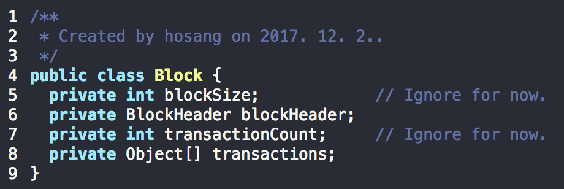
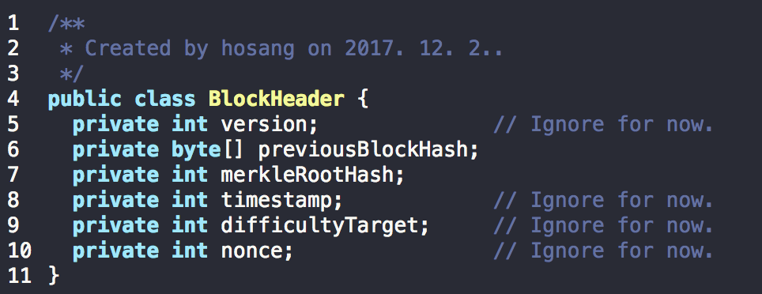

# 블록의 데이터 구조(Data structure of Block)

- 블록 크기 : 이 필드를 제외한 나머지 데이터들의 크기를 바이트 단위로 표현한 값
- 블록 헤더 : 블록 헤더는 해당 블록의 메타 데이터를 담고있는 객체
- 거래 카운트 : 거래의 수를 저장하는 필드
- 거래 : 거래 정보를 담고 있는 컬렉션

### 블록 헤더
- 블록의 메타데이터를 담고 있는 객체

- 버전 : 소프트웨어, 프로토콜 등의 업그레이드 추적을 위한 버전 정보
- 이전 블록의 해시 : 블록체인상의 이전 블록(부모 블록)의 해시값
- 머클 루트의 해시 : 머클트리의 루트에 대한 해시값
- **타임스탬프** : 해당 블록의 생성 시각
- **난이도 목표** : 채굴 과정에서 필요한 작업 증명(Proof Of Work)알고리즘의 난이도 목표
- **넌스(nounce)** : 채굴 과정의 작업증명에서 사용되는 카운터

위의 세 가지 하이라이트는 채굴 과정과 연관되는 값들.

`헤더의 데이터 중 블록체인의 동작원리를 이해하는 데에 가장 핵심적인 요소는 **이전 블록의 해시값과 머클루트의 해시값**.`

## 블록의 연결
- 블록의 연결에서 키(Key)는 '이전 블록의 해시(PreviousBlockHash)'
  - 이전 블록의 **헤더**에 대한 해시값
  - 이전 블록의 해시값(PreviousBlockHash)을 계산하는 데에 이전 블록의 헤더 정보만 사용되기 때문
  - 따라서, '블록 해시'라는 용어는 '블록 헤더 해시'와 같은 의미

- 블록 해시값은 SHA-256 알고리즘을 사용해 두 번 해싱하여 얻어지게 됨(Double SHA-256 Algorithm)