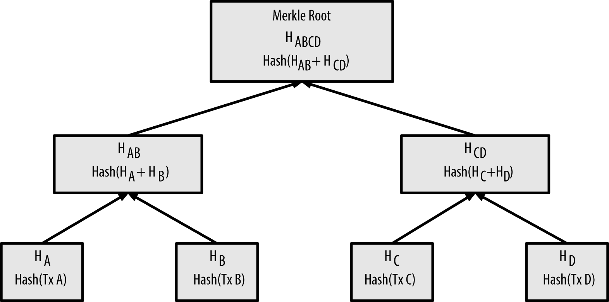

# Block Chain

### 사용 기술
- 분산 데이터베이스 (Distributed Database)
- 암호화 기술 (Cryptography)

### 주 목적
- 거래 정보 (Transactions)를 보다 투명하고 안전하게 관리할 수 있도록 고안된 공공(public) 거래 장부 (ledger)

바라보는 관점에 따라 일종의 네트워크 개념이기도 하며, 분산 저장소로 정의되기도 함

## 핵심 용어
- 블록(Block) : 블록체인을 구성하는 개별 요소, 이전 블록에 대한 참조 값과 거래 내역 정보를 갖고 있음
- 최초 블록 (Genesis Block) : 블록체인은 한 방향으로만 확장이 가능하며, 블록체인 상에서 가장먼저 생성된 블록을 최초 블록 이라고 함
- 블록체인(Block Chain) : 블록들의 연결을 통해서 구성되는 데이터의 집합, 관점에 따라 일종의 네트워크 이기도 함
- 채굴 (Mining) : 비트코인 블록체인은 모든 노드가 새로운 블록을 생성하지 못하도록 일종의 제한을 두었음
    - 많은 양의 컴퓨팅 자원을 통해 특정 문제를 풀어야 함
    - 채굴자(Miner)는 네트워크 안전성을 검증한 것에 대해 보상(reward)를 받음
- 작업 증명(Proof-Of-Work) : 채굴과정에서 새로운 블록을 찾기 위해 사용되는 알고리즘 데이터
- 넌스(nonce) 라 불리는 임의의 값을 대입해 계산을 수행
- 난이도 (Difficulty)를 통해 블록의 채굴속도를 조절할 수 있음

### 머클 트리(Merkle Tree) : 일종의 이진 트리 (Binary Tree)

> [출처](https://bitcoin.stackexchange.com/questions/10479/what-is-the-merkle-root)
- 거래 내역에 대한 요약정보를 해시형태로 담고 있음
- 많은 양의 거래 데이터를 보다 효율적으로 검증하기 위해 사용되는 데이터 구조
- 머클 루트(Merkle Root) : 머클트리의 루트 노드