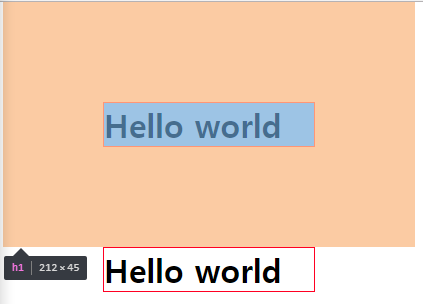
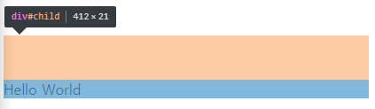
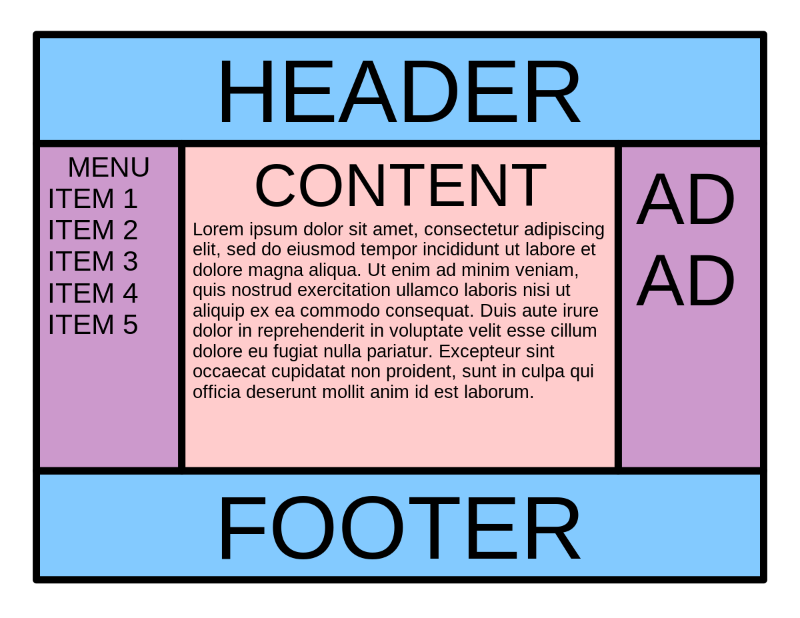
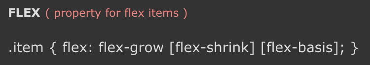

# CSS강의를 듣고 기록
- 강의는 inflearn의 [생활코딩 강의](https://www.inflearn.com/course/css-%EA%B8%B0%EB%B3%B8%EB%B6%80%ED%84%B0-%ED%99%9C%EC%9A%A9%EA%B9%8C%EC%A7%80/)
- 예제를 실습해 보고 저장하거나 핵심 내용을 메모

## 목차
1. [선택자](#선택자)
2. [적용 순서](#적용순서)
3. [서체 다루기](#서체다루기)
4. [레이아웃 기본](#레이아웃기본)
5. [레이아웃 활용](#레이아웃활용)
6. [그래픽](#그래픽)
7. [유지 보수](#유지보수)
8. [Preprocessor](#Preprocessor)
9. [Fontello](#Fontello)
---
## 선택자
### 선택자와 선언
```css
h1 {color:red; text-decoration:underline;}
```
- h1 은 selector로, 어떤 태그를 선택하였는가를 나타냄
- 선택한 태그의 CSS효과는 뒤쪽의 {}안에서 선언됨
> [예제파일](./src/Ex_SelectorDeclaration.html)
### ID 선택자
```css
#select {color:blue; text-decoration:none;}
```
- 태그를 선택자로 할 경우 해당하는 모든 태그의 CSS 효과가 바뀌기 때문
- 원하는 효과를 주고자하는 대상을 ID 속성값을 통하여 구분
> [예제파일](./src/Ex_IDSelectorDeclaration.html)
### 부모 자식 선택자
```css
#lecture>li {color:white; font-size:10px;}
```
- 부모 ID에서 직계 자손인 li태그를 선택한 예
- 직계 자손인 li만 해당 CSS 효과를 받음
> [예제파일](./src/Ex_ParentChildSelecotr.html)
#### Selector 관련 게임
> [CSS DINER](http://flukeout.github.io/)
### 가상 클래스 선택자(Pseudo Class Selector)
```css
a:link{color: black;}
a:visited{color: red;}
a:hover{color: yellow;}
a:active{color: green;}
a:focus{color: white;}
```
- :link - 방문한 적이 없는 링크
- :visited – 방문한 적이 있는 링크
- :hover – 마우스를 롤오버 했을 때
- :active – 마우스를 클릭했을 때
- :focus - tab키 또는 input일 경우 입력값을 받는 상태일 때(focus on 상태)
> [예제파일](./src/Ex_PseudoSel.html)
---
## 적용순서
### 상속
- css에서는 생산성 향상을 위해 기본적으로 상속을 지원함
- 일부 속성은 상속되지 않음(e.g. 폰트의 color는 상속되나 테두리는 상속되지않음)
> [예제파일](./src/Ex_Inheritance.html)
### Cascading(적용 우선순위)
> CSS (Cascading Style Sheet)
- 폭포수형 스타일 시트
- depth로 우선순위를 지정
- [실습](./src/Ex_Cascading.html)
#### 우선순위
1. style attribute (스타일 속성)
2. ID selector
3. class selector
4. tag selector
- 생산성을 위해 좀 더 구체화되어있어야 우선순위가 높다
- 포괄적이면 우선순위가 낮음
- !important를 통해 우선순위를 높게 바꿀 수 있다. (좋은 방법은 아님)
##### syntax
```css
#idsel{color:red; !important}
```
---
## 서체다루기
### 크기 : font-size
> **px** and **em**, **rem**
- px : 고정된 크기, 변하지 않음 (e.g. 사용자가 브라우저의 글꼴 크기를 바꾸었을때 px는 바뀌지 않음)
- em, rem : 상대적인 크기, 사용자가 페이지의 폰트를 가변적으로 변경할 수 있게 할 때
#### 오늘날에는 rem을 사용함 ([예제](./src/Ex_Font_size.html))

### 색상 : Color
1. color name
2. hex
3. rgb
> **이러한 세가지 방식으로 색상을 표시함** **([예제](./src/Ex_color.html))**

### 정렬 : text-align
```css
p{
    text-align: right;
    text-align: center;
    text-align: left;
    text-align: justify;
}
```
1. 오른쪽 정렬
2. 가운데 정렬
3. 왼쪽 정렬
4. 균등하게 정렬(텍스트의 길이가 균등하게 잘림)

#### 많은 양의 텍스트가 필요한 경우, [Lorem Ipsum](https://www.lipsum.com/) 에서 의미없는 텍스트를 가져올 수 있다.

### 서체
#### font-family
```css
h1{
    font-family: "Times New Roman", Times, serif;
}
```
- 띄어쓰기가 있는 경우, ""큰따옴표로 묶어준다
- Times New Roman 폰트가 없을 경우, Times 폰트를 사용하게 됨
- 마지막 폰트는 포괄적인 폰트로 지정함, [예제](./src/Ex_FontFamily.html)
  - serif (장식이 있음)
  - sans-serif (장식이 없음)
  - cursive
  - fantasy
  - monospace (고정폭)

#### line-height
```css
#type1{
    font-size: 2rem;
    line-height: 3;
}
```
- 자간을 조정
- px같은 절대적인 길이를 피해 사용(숫자 2와같은 상대적인 수치 사용), [예제](./src/Ex_FontFamily.html)

#### font
```css
#type2{
    font:bold 2rem/2 arial, verdana, "Helvetica Neue", sans-serif
}
```
- 앞서 사용했던 것들을 함축적으로 사용할 수 있게 함, [예제](./src/Ex_FontFamily.html)

### web font
> [Google Fonts](https://fonts.google.com/)를 사용해서 폰트를 사용하는 기법
- 웹에있는 폰트를 사용자가 다운로드하게 해서 폰트를 사용하도록 함
- 브라우저는 href 링크안에 있는 파일을 다운로드 해서 해석함, [예제](./src/Ex_WebFont.html)

#### Google Fonts에 폰트가 없을 경우
- [Web Font Generator](https://www.web-font-generator.com/)를 사용해서 파일을 업로드하면 webfont를 만들어줌
- 샘플파일과 여러 행태의 폰트파일을 만들어줌
---
## 레이아웃기본
### 인라인, 블록레벨 Element
```html
<h1>Hello World</h1>
안녕하세요. <a href="https://www.naver.com">생활코딩</a>입니다.
```
- h1 태그와 같은 혼자 화면 전체를 다 쓰는, 개행이 되는 element를 Block Level Element라고 함
- a 태그 와 같은 개행이 되지않고, 같은 줄에 위치하는 element를 inline element라고 함

```css
h1{display: inline;}
a{display: block;}
```
> 하지만, [다음](./src/Ex_InlineBlock.html)과 같이 css에서 display 속성을 변경할 수 있다
### BOX MODEL
```css
p{
border: 10px solid red;
padding: 20px;
margin: 40px;
width: 120px;
}
```
> [예제파일](./src/Ex_BoxModel.html)
- margin : element와 element 간의 간격을 조정
### Box Sizing
```css
*{
    box-sizing: content-box;
}
```
- content의 크기만큼 width와 height 값이 지정이 된다.
```css
*{
    box-sizing: border-box;
}
```
- border-box의 경우 서로 border의 두께가 다름에도 불구하고 경계의 크기가 같아짐
### Margin Collapsing(마진 겹침)

- 두 개의 태그 사이의 마진이 서로 겹쳐지는 현상
- 두 개의 태그 사이에 **더 큰 마진값**이 간격이 된다

#### Parent와 Child간의 마진 겹침 현상

- 부모태그와 자식태그 사이에서 일어날 수 있는 마진 겹침
- 부모 Element가 **시각적인 요소**가 없는 상태일 때, 부모와 자식 element의 margin값중 **큰 쪽의 값**을 사용하게 된다.

## Position
### static, relative
```css
#me{
    position: static;
}
```
- 기본적으로, css는 position 값이 static으로 되어 있음
- static인 경우, 지정한 offset 값을 무시하고 원래 위치해야하는 곳에 정적으로 위치함
```css
#me{
    position: relative;
    left: 100px;
    top: 100px;
}
```
- offset을 사용하기 위해서는, position을 relative로 지정해야 함
- [예제](./src/Ex_Position_1.html)에서는 상대적으로 부모element를 기준으로 왼쪽에서 100px, 위쪽에서 100px 이동시킴
### absolute
```css
#me{
    position: absolute;
}
```
- html element의 위치를 기준으로 함
- 부모와의 link가 끊기기 때문에, 자신의 크기는 content 크기만해짐
- position 값이 static이 아닌 부모가 있다면, 그 부모의 위치를 기준으로 위치가 정해짐
> [예제 파일](./src/Ex_Position_2.html)
### fixed
```css
#me{
    position: fixed;
}
```
- 스크롤과 무관하게 고정
- absolute와 비슷하게 부모와의 link가 끊기기 때문에, 자신의 크기는 content 크기만해짐
- 부모 element들은 자식을 없는 셈 친다
> [예제 파일](./src/Ex_Position_3.html)
---
## 레이아웃활용
### flex?
- 레이아웃을 코드로써 표현
- 정렬하고자 하는 아이템들은 컨테이너의 역할을 하는 부모태그가 필요하다
### Usage
```css
.container{
            display: flex;
            flex-direction: row;
}
```
- [예제](./src/Ex_Flex_1_basic.html) 에서 볼 수 있듯, display 값을 flex로 준다
- flex-direction의 default 값은 row이다. row또는 column으로 설정된 부모 container의 영향으로 자식 item들은 block level element와 같은 효과를 얻는다
#### Flex basis
- flex element의 방향에 해당하는 크기를 지정한다
- row면 수평(width), column이면 수직(height)

#### Flex Grow
```css
.item{
    flex-grow: 1;
}
```
- 부모 element의 크기를 자식 element가 n/1로 나누어서 크기를 조정함

**특정 element의 grow값을 더 크게하고싶은 경우**
```css
.item:nth-child(2){
    flex-grow: 2;
}
```
- :nth-child() 선택자를 이용해 특정 element를 선택하고 원하는 flex-grow값을 준다.
- flex-grow값은 다른 값이 1일 때 이 element에만 2를 준다면 이 element는 다른 element의 grow의 2배가 된다.
- [예제-Grow, Shrink](./src/Ex_Flex_2_GrowShrink.html) 참고

#### Flex Shrink
```css
.item:nth-child(2){
    flex-basis: 300px;
    flex-shrink: 0;
}
```
- [예제](./src/Ex_Flex_2_GrowShrink.html) 참고, [영상](https://youtu.be/pgFyqS4oCIc) 참고
- shrink를 0으로 주면 화면이 작아질 때 item 2 의 부피를 줄여가며 공간분담을 하지 않음
- 반대로, 1을 주면 작아질 때 공간분담을 함(default)

#### Holy Grail

> [예제](./src/Ex_Flex_3_HolyGrail.html)또는 [검색 결과](https://hyunseob.github.io/solved-by-flexbox-kr/demos/holy-grail/)를 참고
- 레이아웃 구성 형태를 말함

#### 기타 속성들
> [Flex Playground](https://codepen.io/enxaneta/pen/adLPwv)에서 flex 속성들을 살펴볼 수 있다.
#### container
> align-content = align item과 유사하나, 그룹과 그룹사이의 정렬을 결정함
> align-item = item을 정렬
#### items
> align-self = 특정한 것만 예외적으로 값을 주고싶을 때 
> order = 아이템의 순서를 바꾸고 싶을 때

- flex-grow, flex-shrink, flex-basis의 축약
### 미디어 쿼리 기본
- 해당하는 장치에 적합한 표현을 할 수 있도록 해주는 기술
- e.g. 반응형 디자인

#### [Example](./src/Ex_MediaQuery.html)
```css
@media (max-width:600px) {
    body{
        background-color: green;
    }
}
@media (max-width:500px) {
    body{
        background-color: red;
    }
}
@media (min-width:601px) {
    body{
        background-color: blue;
    }
}
```
- width 값이 500px보다 작아졌을 때 body의 color가 red가 되는 코드
- min-width 일 경우, 최소 500px일 때 라는 뜻 으로 해석됨
- 모든 cascading의 조건이 같다면, 코드가 나중에 나오는 것이 우선순위가 높아짐
- 작은 구간이 아래로 위치하도록 해야 함

### 미디어쿼리 응용
- [예제](./src/Ex_MediaQuery_2.html)에서는, 모바일 환경을 가장하여 페이지를 구성함
```css
@media (max-width:500px)
```
- 500px 이하로 줄어들었을 때를 조건으로 함
> [W3school](https://www.w3schools.com/css/css3_mediaqueries.asp)의 media queries 문서 참고

### Float 기본
