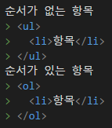

# HTML 강의를 듣고 기록
- 강의는 Inflearn의 [생활코딩 html기초](https://www.inflearn.com/course/html-%EA%B8%B0%EC%B4%88/)
- 예제를 저장하거나 핵심 내용을 기록.

## DTD (DOCTYPE)
- DTD (Document Type Definition)
- 브라우저로 하여금, 문서의 정의를 알림

## 띄어쓰기
```
&nbsp;
```
### 표 예제
[JSFIDDLE](https://jsfiddle.net/bdhLzqe8/1/)

## 목록


- 연관되어 있는 항목들을 나열할 때 사용
- 순서가 없는 항목들은 ul(unordered list), 순서가 없는 항목은 ol(ordered list)를 사용
- css와 함께 메뉴로도 사용
- [예제](ex/Ex_ul.html)

## 이스케이핑
- html 코드를 화면에 표시하기 위해 사용
- 브라우저에 의해 해석되기 때문에 표시하기 위해서는 escaping을 사용

### 코드 리스트
```
&amp; = &
&lt; = <
&gt; = >
&guot; = "
&apos; = '
```
## Definition of HEAD tag
- 문서가 어떤 내용을 담고 있는가에 대한 정보

#### 메타 데이터
- 데이터를 설명하는 데이터 (문서의 정보를 기술함)
- HEAD tag 아랫쪽에 들어감
- e.g. 어떤 favicon을 쓰는가, 어떤 JS를 쓰는가에 대해
- 속성을 통해 문서를 설명
- [예제](ex/Ex_meta.html)

## Form
- 사용자의 데이터를 서버에 전송하는 방법
- e.g. 사용자의 아이디와 비밀번호를 입력받아야 할 때, 회원가입을 하기 위해 개인정보를 입력받아야 할 때, 파일을 업로드 해야할 때
- [예제](ex/Ex_form.html)
- [JSFIDDLE](https://jsfiddle.net/g5ut8407/)

#### GET
- url에 ?로 구분되는 파라미터 형태로 전송
- 전송할 수 있는 정보가 제한되어 있음
- [퍼머링크](https://ko.wikipedia.org/wiki/%ED%8D%BC%EB%A8%B8%EB%A7%81%ED%81%AC)로 사용될 수 있다.

#### POST
- header의 body 형태로 전송
- url 상에 전달한 정보가 표시되지 않음
- [퍼머링크](https://ko.wikipedia.org/wiki/%ED%8D%BC%EB%A8%B8%EB%A7%81%ED%81%AC)로 사용될 수 없다
- 서버사이드에 어떤 명령을 수행할 때 사용(e.g. 데이터의 삭제, 수정, 기록 등)

### 텍스트 필드
- 사용자로부터 텍스트 입력을 받음
- 긴 줄의 텍스트로는 [textarea](#textarea) 를 사용함
- 비밀번호를 입력받을 때의 [예제](ex/Ex_FormPwd.html)

#### syntax
```html
<input type="text" name="값의 이름" value="값" disabled="disabled" readonly="readonly"/>
```
- type = text를 사용해야 필드가 됨
- name = 선택한 데이터의 이름
- value = 데이터의 값, 입력한 데이터의 기본 값으로 이 값이 기본적으로 필드에 표시됨
- disabled = 값으로 disabled를 지정하면 텍스트 필드가 불능상태로 됨
- readonly = 값으로 readonly를 지정하면 값이 입력되지 않음, 서버로는 데이터가 전송됨

[예제](ex/Ex_textfield.html) / [JSFIDDLE](https://jsfiddle.net/1sp6w2tu/)

#### hidden field
```html
e.g. <input type="hidden" name="language" />
```
- 화면상에 표시되지 않는 컨트롤
- 서버상으로 값을 넘겨줘야 하나, 사용자에게 표시할 필요가 없는 경우일때 사용

#### Textarea
```html
<textarea name="값의 이름" rows="행의 수" cols="열의 수">값</textarea>
```
- 여러 줄의 텍스트를 입력할때 사용

## 선택
### 라디오 버튼
```html
<input type="radio" name="값의 이름" value="값" checked="checked"/>
```
- 여러개의 항목중 하나만 선택할 수 있도록 제한하는 컨트롤

> [예제 파일](ex/Ex_radioButton.html), [JSFIDDLE](https://jsfiddle.net/a0o7svmd/)


### 콤보박스
```html
<select name="값의 이름" multiple="multiple">
    <option value="선택될 경우 name의 값이 됨" selected="selected"> 값에 대한 표시값</option>
    .... option 반복
</select>
```
> [예제 파일](ex/Ex_ComboBox.html), 
> [JSFIDDLE](https://jsfiddle.net/w2jpeLms/)
#### multiple ?
- 다수의 항목중에 다수를 선택할 수 있게 함

### 체크박스
```html
<input type="checkbox" name="값의 이름" value="값">
```
- 복수의 항목을 선택할 수 있게 하는 컨트롤
- name의 이름 끝에 '[]'를 붙이면 서버측에서 이 값을 배열이라고 인지함
> [예제 파일](ex/Ex_checkbox.html), [JSFIDDLE](https://jsfiddle.net/mfj9b7co/)