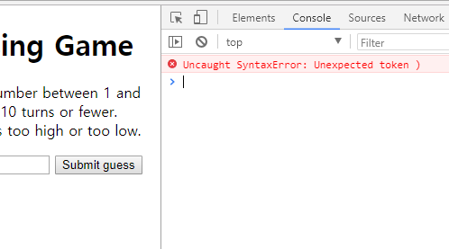

# TroubleShooting Javascript
- 에러의 종류
    - 구문 에러
    - 논리 에러

## 구문(Syntax) 에러 고치기
> - 코드상의 구문 에러 (syntax error)로, 대게 철자가 잘못되어 발생
> - 출력된 에러메시지로 확인 가능

> )이 코드에 누락되어 발생한 Syntax Error

## 논리 에러
> - 구문은 올바르나, 코드의 의미 자체가 잘못된 경우
> - 프로그램은 정상적으로 돌아가나, 원치않는 결과를 얻은 경우
> - 에러가 직접적으로 표시되지 않아 에러 수정이 힘듦