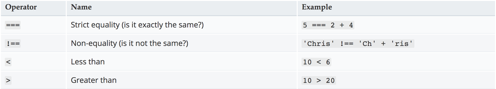
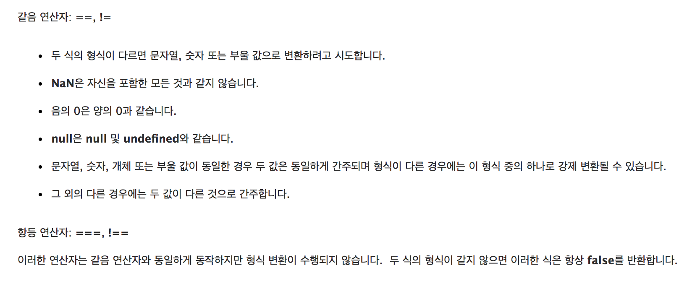

# JavaScript
자바스크립트 학습
## Index
> - [Number Guessing Game](Number-Guessing/README.md)

---
### JS의 비교 연산자

> [출처 : MDN WEB DOCS(자바스크립트 기초)](https://developer.mozilla.org/ko/docs/Learn/JavaScript/First_steps/A_first_splash)

> 같음 연산자와 항등 연산자의 차이

> [출처 : MSDN](https://msdn.microsoft.com/ko-kr/library/ky6fyhws(v=vs.94).aspx)

