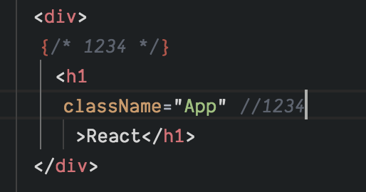

# JSX
- html과 유사하나, 지켜야할 몇가지 규칙이 있음
## 꼭 닫혀야 하는 태그
- 태그는 꼭 닫혀있어야 한다 한 예로 &lt;div&gt;태그가 열려있으면 &lt;/div&gt;태그로 닫아주어야 한다
```JSX
import React, { Component } from 'react';

class App extends Component {
  render() {
    return (
      <div>
        <input type="text" >
      </div>
    );
  }
}

export default App;
```
- 다음과 같은 상황에서는 input태그가 닫혀있지 않으므로 에러가 발생한다
```html
<input type="text"/>
```
- self closing tag로 닫아준다

## 감싸져 있는 엘리먼트
- 엘리먼트가 두개 이상일 경우 반드시 하나의 부모 엘리먼트로 감싸져야 한다
```JSX
import React, { Component } from 'react';

class App extends Component {
  render() {
    return (
      <div>
        hello
      </div>
      <div>
      bye
      </div>
    );
  }
}

export default App;
```
> 에러 발생

```html
<div>
    <div>
    hello
    </div>
    <div>
    bye
    </div>
</div>
```
- 다음과 같은 방법으로 해결

### Fragment
- 위와같은 방법이 마음에 들지 않을 경우 Fragment를 사용하면 된다
- 불필요한 div가 발생하지 않는다

```jsx
import React, { Component, Fragment } from 'react';
```
- 다음과 같이 import 하는 과정에서 Fragment를 추가하고
```JSX
<Fragment>
    <div>
        hello
    </div>
    <div>
    bye
    </div>
</Fragment>
```
- Fragment로 감싸주면 된다

## JSX 내부에서 자바스크립트 값 사용하기
```jsx
import React, { Component, Fragment } from 'react';

class App extends Component {
  render() {
    const name = "LAD";
    return (
      <div>
      hello {name}
      </div>
    );
  }
}

export default App;
```
- const로 정의한 name value를 중괄호를 통해 호출

### var, let, const
- var는 함수단위 스코프이기 때문에 함수안의 블록에서 값이 바뀌어도 그 값이 유효함
- let과 const는 블록단위 스코프이기 때문에 블록을 벗어나면 블록안에서 정의한 값은 유효하지 않음

### var, let, const 언제 쓰이는가?
- var는 더이상 사용하지 않는다
- let은 유동적인 값에서 사용
- const는 한번 선언하고 나서 고정적인 값일 경우

## 조건부 렌더링

- 위와같이 삼항 연산자를 사용하거나


- and 연산자를 사용해서 조건부 렌더링이 가능하다

## JSX에서 CSS 스타일과 Class 사용하는 방법
```jsx
const style = {
    backgroundColor: 'black',
    padding: '16px',
    color:'white',
    fontSize: '16px'
};
```
- 다음과 같이 객체형태로 스타일을 만든다
- background-color와 같이 - 가 필요한 경우 카멜표기법을 사용해 backgroundColor로 작성하면 된다

```jsx
<div>
    <div style={style}>Hello LAD</div>
</div>
```
- 다음과 같이 사용하면 스타일을 적용할 수 있다

### Class
- React에서는 className이라고 명시를 해줘야 한다 (class로 작성해도 작동은 하나, className이 올바른 컨벤션이다)
```jsx
<div className="App"></div>
```

## 주석
- 일반적으로 자바스크립트에서 하던 주석은 그대로 렌더링 되어버림
- 멀티라인의 경우 중괄호로 감싸주면 된다


