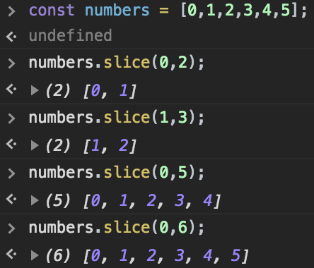
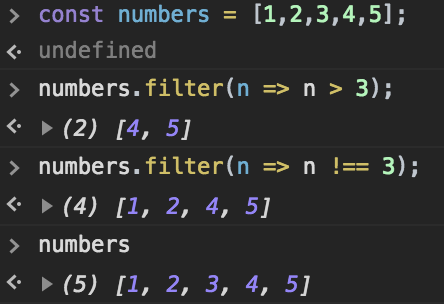
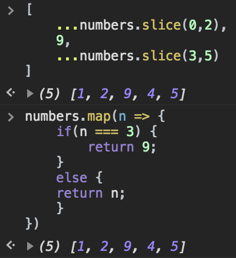

# 배열 데이터 렌더링 및 관리

## 배열에 데이터 삽입하기

- React 에서는 불변성을 중시하므로 배열을 업데이트 할 경우 .concat 함수를 통해 값을 업데이트 한다
- 기존에 있던 배열은 수정하지 않고 새로운 배열을 만들어 데이터를 업데이트하고 그 배열을 기존의 배열의 자리에 넣어줌

```jsx
id = 0;
state = {
  information: []
};
handleCreate = data => {
  const { information } = this.state;
  this.setState({
    information: information.concat({
      ...data,
      id: this.id++
    })
  });
};
```

- [비구조화 할당](https://developer.mozilla.org/ko/docs/Web/JavaScript/Reference/Operators/Destructuring_assignment)을 통해서 가독성을 높였다

**Spread operator 를 사용하지않는 다른 방법**

```jsx
this.setState({
  information: information.concat({
    name: data.name,
    phone: data.phone,
    id: this.id++
  })
});
```

**또는, object.assign 함수를 사용한 방법**

```jsx
this.setState({
      information: information.concat(Object.assign({}, data, {
          id: this.id++
      })))
    });
```

- 앞의 비어있는 객체에 data 를 집어넣고 id 값을 증가시킨 뒤 이것또한 집어넣는다

## 배열 렌더링 하기

- map() 함수는 배열을 특정 함수를 사용해서 전체적으로 변환해 주고 싶을 때 사용함
- map 함수를 사용할 때 아래 예제와 같이 key 값을 사용하는데, 이는 여러개의 컴포넌트를 렌더링 할 때 고유값을 통해 업데이트 성능을 최적화 한다
- key 값을 통해 내부적으로 추가하거나 제거하거나 업데이트 할 때 좀 더 효율적으로 작업을 할 수 있게 함

## 배열에서 데이터 제거

- 배열안의 데이터를 불변성을 지키면서 수정할 때는 내장함수 .slice 혹은 .filter 를 통해 사용이 가능
- 불변성을 해치지 않고 새로운 배열을 만들어 원하는 범위내의 값을 가져옴
  > e.g. slice
  > 

> e.g. filter
> 

- 함수를 사용해 보다 편하게 범위를 지정할 수 있음

## 배열에서 데이터 수정

- slice 함수 혹은 map 함수를 사용할 수 있다
- slice 함수를 통해 범위를 지정할 수도 있다
- map 함수를 통해서 특정 조건이 부합할 때 만 해당되도록 지정할 수 있다


