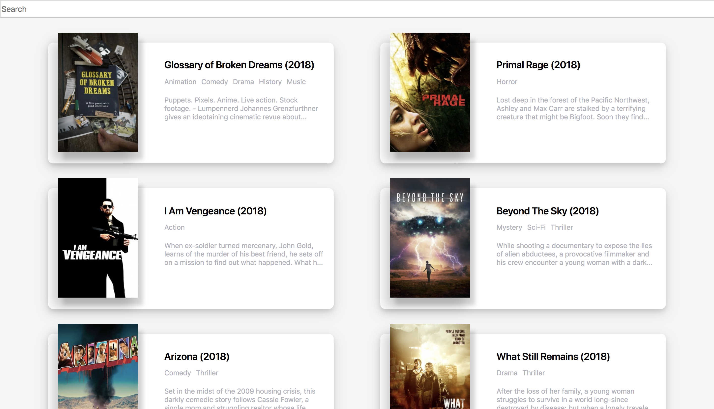

# REACT MOVIE APP

최신영화들을 개봉순서로 나열한 간단한 리스트 
- 반응형 웹으로, 모바일에서도 최적화된 해상도
- React.js 라이브러리를 사용하여 빌드
- yts api를 사용해 영화 데이터를 json 형태로 받아온다
- [Demo Site](https://hth225.github.io/movie_app/)

#### 18.09.14
- 검색기능 구현
- movies에 받아온 데이터를 토대로, 기본값을 this.state.searchDate에 세팅
- 검색창이 비었을 경우 기본값(모든 영화목록)을 렌더링함
- 기존의 yts보다 정보가 많은 [The Movie DB](https://www.themoviedb.org/)의 api로 변경하는 방안 계획